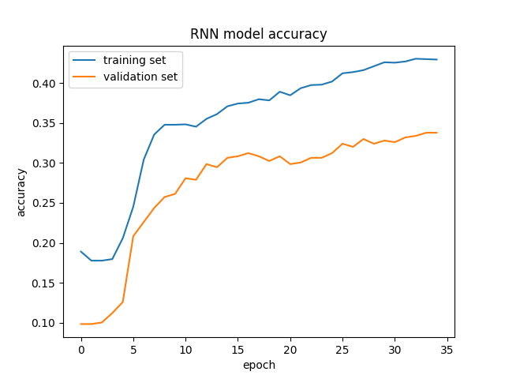

# recover-messages

Sequence classification with n-gram and RNN-based models.

Here the goal is to predict hidden characters in chatbot dialogues.

In the training set, there are ```2543``` complete sentences extacted from chatbot dialogues. With machine learning algorithms, one can identify the patterns in the seemingly nonsense sequences and recover the hidden last character for the test set, which consists of ```379``` uncomplete sequences.

  * [Requirements](#requirements)
  * [Data preprocessing](#data-preprocessing)
  * [Trigram character model](#trigram-character-model)
  * [RNN model](#rnn-model)
  * [Results](#results)
  * [Further work](#further-work)

## Requirements
Python requirements are listed in [requirements.txt](requirements.txt). To install these requirements, run:

```bash
pip install -r requirements.txt
```

## Data preprocessing
In order to convert the given data into the form that trigram character models and RNN models can utilize, there is a data preprocessing module. By using the methods defined in **data_preprocessing.py**, it is possible to extract training and test sentences from the given .csv files, in the data structures needed by trigram models and by RNN models.

## Trigram character model
By counting the trigram, bigram and unigram character groups in the sequences of the training set, it is possible to recover hidden characters in the test set.

Trigram model is implemented in pure Python, no external library is used. However, this is a simplistic ngram implementation. A simple backoff logic is used to generate predictions in case of missing trigrams (and probably some missing bigrams) in training sequences. Also, since the test set contains sequences with only one missing character, there is an option to consider only the last ngram in the sequences of training set while training the model. Implementation can be found in [trigram.py](trigram.py). Pre-trained trigram character model is also available in this module.  Results obtained using trigram models can be found in the [Results](#results) section. 

## RNN model
In order to explore more complex patterns in the given chatbot sequences, recurrent neural networks are used. Although the training set includes only ```2543``` sentences, it is possible to train RNN models to gain higher accuracies compared to trigram character models. Implementation can be found in [rnn.py](rnn.py).

A hyperparameter tuning script is also provided for RNN models to determine the best performing hyperparameter combination. By using the scikit-learn's grid-search implementation, it's possible to tune RNN hyperparameters such as embedding size (used in the embedding layer of RNN), RNN unit size, gradient descent optimizer, RNN type (GRUs and LSTMs), etc. Also, a k-fold cross validation with ```k=5``` is used during hyperparameter tuning. Resulting best parameter combination and the RNN model trained with the resulting configuration is available in **rnn_best_params.pkl** and **rnn_model.h5** respectively. For reproducing the hyperparameter search result, run:
```bash
python tune.py
``` 

After the search is finished, new best parameter combination and newly trained RNN model will be available on the same filepaths.
<br>

Results obtained using RNN models and monitoring of the training process with RNN models can be found in the [Results](#results) section.

## Results
To reproduce the results obtained with the models explained above, simply run:
```bash
python test.py
```

Surprisingly, simple trigram character models can reach accuracies above ```60%``` on the test sequences. Also, counting only the last ngrams in the training sentences appears to improve the accuracy significantly. Thus, it can be discussed that patterns seen in the first part of the chatbot sequences do not provide so much information about the last characters. Following results are obtained with trigram character models:
```
Accuracy of standard trigram character model on test set: 0.62%
Accuracy of trigram character model on test set when trained only on last ngrams: 0.731%
```
<br>

With recurrent neural networks, following parameter combination appeared to be the best (within the boundaries of the defined search grid):
```text
{
	"batch_size": 32,
 	"dropout_rate": 0,
	"embedding_size": 32,
	"epochs": 35,
	"model_depth": 1,
	"optimizer": "rmsprop",
	"rnn_type": keras.layers.recurrent.GRU,
	"rnn_units": 16
}
```

In the plots below, more detail about the training process of the RNN model is available.
Training accuracies:
<br>

<br>
Training losses:
<br>

<br>

Following result is obtained with the given RNN model:
```
Accuracy of RNN model on test set: 0.807%
```

It is obvious that RNN model performed better on the test set compared to trigram character models. So, we can say that chatbot sequences contain complex patterns which cannot be revealed by counting the ngrams. 

However, surprisingly, the RNN model reaches a lower accuracy on the training set compared to test set. This shows that the given test set might not represent a generic result and it might contain easier patterns than the training set. Due to the low sample size in the test set, it is hard to make assumptions. But, a simple investigation reveals that test set contains only ```13``` different classes to be predicted as the hidden last character of the sequence, out of ```33``` available classes. Thus, it can be said that the test set is highly unbalanced (training set includes ```31``` different characters out of ```33```). This might be the main reason behind this discrepancy.

## Further Work
- Extending hyperparameter search.
- Train RNN models with shorter length inputs.
- Increase the sample size.
