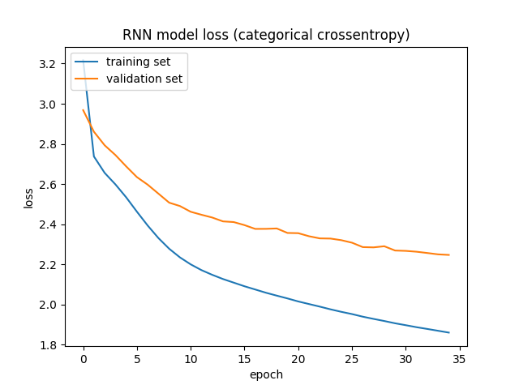

# recover-messages
In this project, I aimed to recover hidden characters in the given chatbot dialogues. 

In the given training set, there are ```2543``` complete sentences extacted from chatbot dialogues. With the machine learning algorithms it is possible to learn patterns from given sentences and to recover hidden last character in the given test set, which consists of ```379``` uncomplete sentences.

<br/>

  * [Requirements](#requirements)
  * [Data Preprocessing](#data-preprocessing)
  * [Trigram Character Model](#trigram-character-model)
  * [RNN Model](#rnn-model)
  * [Results](#results)
  * [Further Work](#further-work)

## Requirements
This project requires Python 3 installation. Additionally, following python libraries need to be installed:
```
numpy
keras
matplotlib
scikit-learn
```

## Data Preprocessing
In order to convert the given data into the form that trigram character models and RNN models can utilize, I developed a data preprocessing module. By using the methods defined in **data_preprocessing.py**, it is possible to extract training and test sentences from the given .csv files, in a list form as needed by trigram models and in the encoded ```numpy``` array form as needed by RNN models.

## Trigram Character Model
The first algorithm I used to learn patterns in the given chatbot sentences is the trigram character model. By counting the trigrams, bigrams and unigrams in the sentences of training set, it is possible to recover hidden characters in the test set.

No external library is used to count ngrams and calculating possibilites. A simple backoff logic is implemented to generate predictions in case of missing trigrams (and probably some missing bigrams) in training sentences. Also, since the test set contains sentences with only the last characters missing, there is an option to count only the last ngrams in the sentences of training set while training the ngram model. In **trigram_models.py**, necessary tools to count ngrams and to create trigram character models are implemented. Pre-trained trigram character model is also available in this module.  Results obtained using trigram models can be found in the [Results](#results) section. 

## RNN Model
In order to investigate more complex patterns in the given chatbot sentences, I used recurrent neural networks. Although the training set includes only ```2543``` sentences, it is possible to train RNN models to gain higher accuracies compared to trigram character models. To create RNN models, deep learning library ```Keras``` (running on top of ```TensorFlow```) is used.  

I also created a hyperparameter tuning script for RNN models to determine the best architecture needed in this project. In **tune_rnn_params.py**, I utilized ```GridSearchCV``` tool of ```scikit-learn``` library to tune parameters such as embedding size (used in the embedding layer of RNN), RNN unit size, gradient descent optimizers, RNN type (GRUs and LSTMs) etc. Resulting best parameter combination and the RNN model trained with the resulting configuration is available in **rnn_best_params.pkl** and **rnn_model.h5** respectively. To extend the parameter search and look for better architecures, it will be enough to add new options in the hyperparameter tuning script and run the following:
```
python tune_rnn_params.py
``` 

After the search is finished, new best parameter combination and corresponding (trained) RNN model will be available in the same filepaths.
<br>

Results obtained using RNN models and plots of training process of RNN models can be found in the [Results](#results) section.

## Results
To reproduce the results obtained with the models explained above, simply run:
```
python test_models.py
```

Surprisingly, simple trigram character models can reach accuracies above ```60%``` on the test sentences. Also, counting only the last ngrams in the training sentences apperas to improve the accuracy significantly. Thus, it can be discussed that patterns seen in the first part of the chatbot sentences do not provide so much information about the last characters. Following results are obtained with trigram character models:
```
Accuracy of standard trigram character model on test set: 0.62
Accuracy of trigram character model on test set when trained only on last ngrams: 0.731
```
<br>

With recurrent neural networks, following parameter combination appeared to be the best (within the boundaries of the defined search grid):
```
{
	'batch_size': 32,
 	'dropout_rate': 0,
	'embedding_size': 32,
	'epochs': 35,
	'model_depth': 1,
	'optimizer': 'rmsprop',
	'rnn_type': keras.layers.recurrent.GRU,
	'rnn_units': 16
}
```

In the plots below, more details about the training history of RNN model with the given architecture are available.
Training accuracies:

<br>
Training losses:

<br>

Following result is obtained with the given RNN model:
```
Accuracy of RNN model on test set: 0.807
```

It is obvious that RNN model performed better on the test set compared to trigram character models. So, we can say that chatbot sentences contain complex patterns which cannot be revealed by counting the ngrams. 

However, surprisingly, the RNN model reaches a lower accuracy on the training set compared to test set. This shows that the given test set might not represent a generic result and it might contain easier patterns than the training set. Due to low sample size in the test set, it is hard to make assumptions. But, a simple investigation reveals that test set contains only ```13``` different classes to be predicted as the hidden last character of sentence, out of ```33``` available classes. Thus, it can be said that the test set is unbalanced (training set includes ```31``` different characters out of ```33```). This might be another reason behind this discrepancy.

## Further Work
Due to limited resources, it was not possible to conduct further research about the project. However, in order to gain higher accuracies on the test set, the first thing I would do is to extend the hyperparameter search grid to look for alternative architectures. Different number of epochs, dropout rates and model depth may provide a better architecture in the given problem.

One other thing I wanted to try is to train RNN models with shorter length of inputs (instead of providing the first ```8``` characters in the sentences). It might help the model to focus on the patterns appearing at the end of sentences and it might increase the accuracy of the model, as we see this kind of behaviour with trigram character models.

The main improvement would be increasing the sample size (not possible in our case). Especially, by collecting more examples for testing the models and by making the test set more balanced, we can obtain more generic results.
